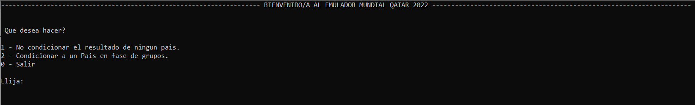
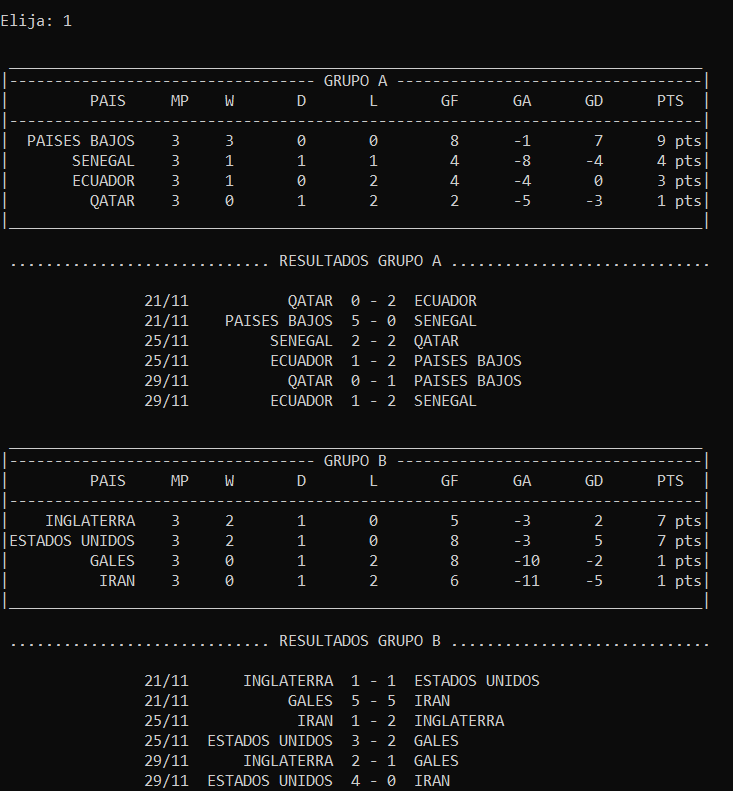
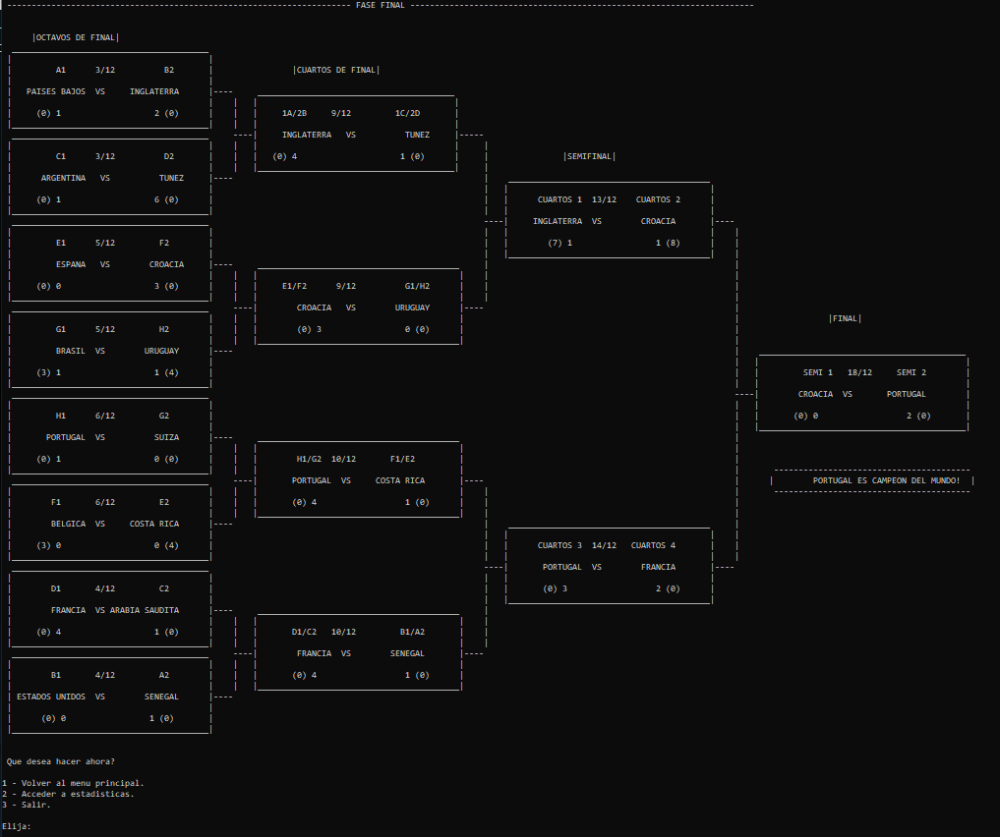
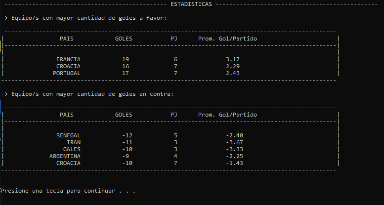
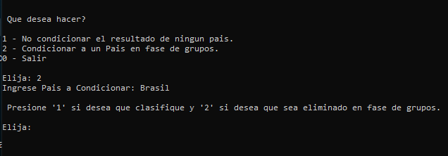

# 🗺️ 2022 World Cup Simulator
# Simulador de Mundial Qatar 2022 🗺️

🇪🇸 Bienvenido al simulador del mundial de Qatar 2022.
Este repositorio creado como proyecto para la universidad simula los resultados de los partidos de la copa del mundo.
Incluye resultados condicionados, aplicación de probabilidad ajustadas a resultados históricos y muestra de estadísticas.
¡Adelante!

🇺🇸  Welcome to the 2022 World Cup Simulator.
This repository, created as a university project, simulates the results of the 64 matches of the World Cup.
It includes conditional outcomes and custom-made probabilities based on past World Cup results and statistics.
Feel free to take a look!

Disclaimer: This project has been created with a spanish interface.

## Technologies Used 📋

◾ Lenguage: C

◾ IDE: Codeblocks

## How to use & Features: 🚀

🇪🇸 Al iniciar, nos encontramos con el menú principal que nos pregunta si queremos condicionar el destino de un país en particular.
🇺🇸 At the beginning, we encounter the main menu prompting us if we want to condition the fate of a particular country

🇪🇸 Muestra de la simulación de la fase de grupos.
🇺🇸 Simulation of the group stage.

🇪🇸 Muestra de la simulación de la fase final.
🇺🇸 Simulation of the play-off stage.

🇪🇸 Listado de estadisticas de equipo mas goleadores y mas goleados con su respectivo promedio de gol por partido.
🇺🇸 List of team statistics: top goal scorers and most conceded goals, along with their respective average goals per match 

🇪🇸 Es posible condicionar el futuro de un país en particular forzando su descalificacion en fase de grupos.
🇺🇸 It's possible to determine the fate of a specific country by ensuring its disqualification during the group stage.

## Custom-Made Probabilities 📊

